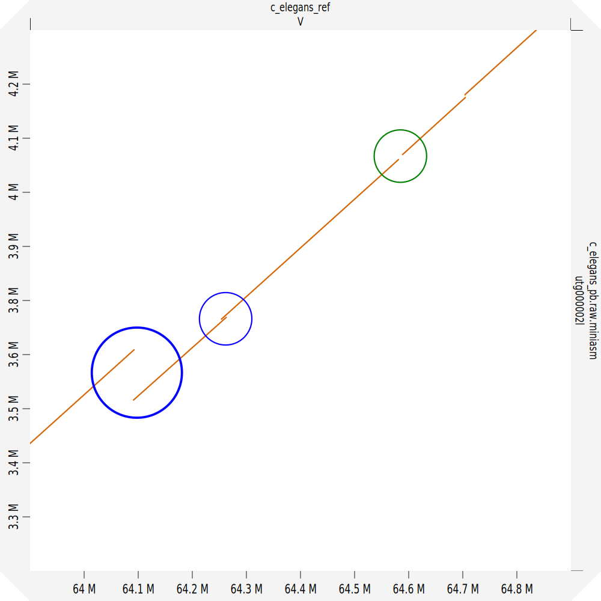
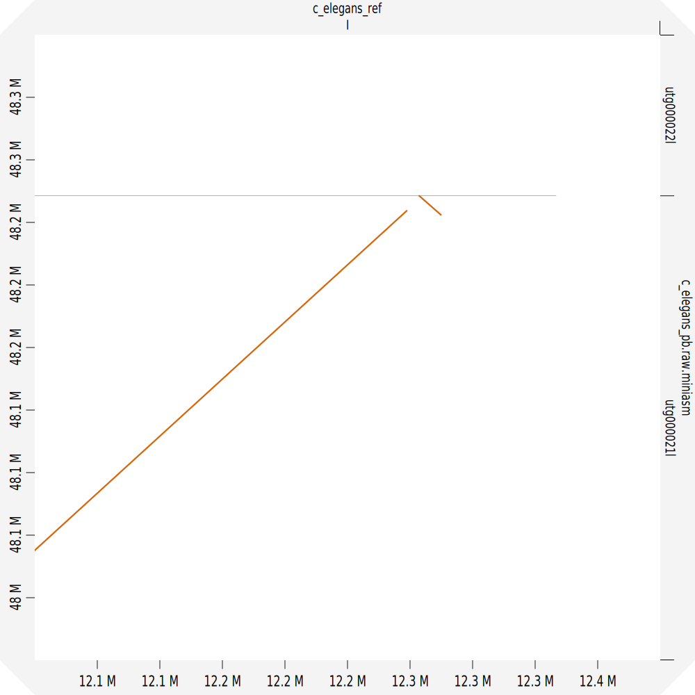
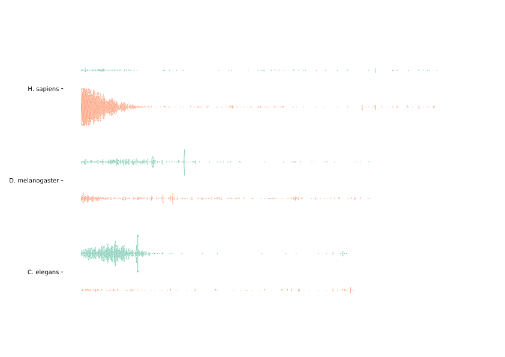

+++
template = "page.html"
title = "Misassemblies in noisy assemblies"
date = 2019-09-16
draft = true
tags = ["long-read", "assembly", "evaluation", "misassemblies"]
+++

I think that all the people who have ever done a genome assembly one day say: "Ok my assembly was cool, but now how I can be sure that it's the best and it don't contain a lot of errors ?"

We have many technics to evaluate the quality of assembly (it isn't a complete review, sorry):
- wih only assembly information:
  + with [N50 family metrics](https://doi.org/10.1089/cmb.2017.0013)
  + by analyse read remapping against assembly [AMOSValidate](http://amos.sourceforge.net/wiki/index.php/Amosvalidate), [REAPR](https://www.sanger.ac.uk/science/tools/reapr), [FRCbam](https://github.com/vezzi/FRC_align), [Pilon](https://github.com/broadinstitute/pilon/wiki), [VALET](https://www.cbcb.umd.edu/software/valet)
  + by computing the probability of the reads dataset that can be generated from the assembly ([ALE](https://doi.org/10.1093/bioinformatics/bts723), [CGAL](https://doi.org/10.1186/gb-2013-14-1-r8), [LAP](https://doi.org/10.1186/1756-0500-6-334))
- by using external information: 
  + count the number of core genes present in an assembly, [BUSCO](https://busco.ezlab.org/)
  + transcriptome information, [for example, *Bos taurus* genome validation](https://doi.org/10.1186/gb-2009-10-4-r42)
  + synteny information [Lui et al](https://doi.org/10.1186/s12859-018-2026-4)
  + map assembly against a near reference genome, [quast](https://doi.org/10.1093/bioinformatics/btt086) or [dnAQET](https://bmcgenomics.biomedcentral.com/articles/10.1186/s12864-019-6070-x)
  
Note that for the last bullet point, if you are using quast with a reference genome, you already have, by definition, a reference genome. So why perform an assembly?

The main case where we perform something like that was when we want to evaluate different assembly pipelines on the same read data set. To evaluate a new assembly pipeline, you have to test a different set of parameters, and evaluate the impact of adding or changing the tools that are part of it.

Quast is a very useful tool and now they integrate many other assembly evaluating tools (BUSCO, [GeneMark](http://exon.gatech.edu/GeneMark/), [GlimmerHMM](https://doi.org/10.1093/bioinformatics/bth315), [barnap](https://github.com/tseemann/barrnap))

Recently, with Rayan Chikhi and Jean-Stéphane Varré, we published a [preprint](https://www.biorxiv.org/content/10.1101/674036v2) about [yacrd](https://github.com/natir/yacrd/) and [fpa](https://github.com/natir/fpa), two new standalone tools. These tools can be included in assembly pipelines to remove very bad reads regions, and filter out low-quality overlaps. We evaluated the effect of these tools on some pipelines ([miniasm](https://github.com/lh3/miniasm) and [redbean](https://github.com/ruanjue/wtdbg2)). Using quast, we compared the results with the assembly quality of different pipelines.

We sent this paper to a journal, and one of the reviewers said something along the lines of:
"quast isn't a good tool to evaluate high error assembly, the number of misassemblies was probably over evaluated."  
And it's probably true.

Miniasm and redbean perform assemblies without read correction steps (and without consensus step for miniasm). The low quality of a contig sequence is a real problem: quast could confuse a misaligned low-quality region with a misassembly.

In this blog post, I want to answer the following questions:
1. how to run quast on long-read uncorrected misassemblies
2. is the quast misassemblies count a good tool to evaluate / compare assemblies?
3. can we find better metrics than just a number of misassemblies?

If you have no time to read all this long and technical details you can go directly to the [TL;DR](#take-home-message).

In this post I will talk about quast and not dnAQET, which has just been released, but dnAQET uses the same method (mapping the assembly against the reference) and the same misassembly definition as quast. It seems to me that what I am going to say about quast also applies to dnAQET. But go read the dnAQET publication, there are lots of super interesting ideas in it.

## Dataset, assembly pipeline, analysis pipeline her version and parameter

For our tests we are going to use two Nanopore datasets and one Pacbio dataset.
- Reads:
  * [Oxford nanopore D melanogaster](https://www.ebi.ac.uk/ena/data/view/SRX3676783) 63x coverage
  * [Oxford nanopore H sapiens chr1](http://s3.amazonaws.com/nanopore-human-wgs/chr1.sorted.bam) 29x
  * [Pacbio RS P6-C4 C elegans](http://datasets.pacb.com.s3.amazonaws.com/2014/c_elegans/list.html) 80x
- References:
  * [D. melanogaster](https://www.ncbi.nlm.nih.gov/assembly/GCF_000001215.4) 143.7 Mb
  * [C. elegans](ftp://ftp.ensembl.org/pub/release-95/fasta/caenorhabditis_elegans/dna/Caenorhabditis_elegans.WBcel235.dna.toplevel.fa.gz) 100.2 Mb
  * [H. sapiens chr1](ftp://ftp.ensembl.org/pub/release-95/fasta/homo_sapiens/dna/Homo_sapiens.GRCh38.dna.chromosome.1.fa.gz) 248.9 Mb
  
To perform assembly we use minimap2 (version 2.16-r922) and miniasm (version 0.3-r179) with recommended preset for each sequencing technology (`ava-ont` and `ava-pb`).

We use [racon](https://github.com/lbcb-sci/racon) (v1.4.3) for polishing. For mapping reads against assembly we use minimap2, with recommended preset for each sequencing technology.

We use quast version v5.0.2.

All dotplots were produced by [D-Genies](http://dgenies.toulouse.inra.fr/).

## Quast misassemblies definition

What are quast misassemblies? Do we have different misassembly types? How are they defined? 

Quast defines three types of misassemblies: **relocation**, **translocation** and **inversion**.

### Relocation

A relocation can occur based on signal from two mappings of the same contig against the same chromosome. We have two cases:
- either the two mappings are separated by an unmapped region (case **A**)
- or they map on the same chromosome with a shared mapping area  (case **B**)

A misassembly is said to occur when $L_x$ and $L_z$ > 1kbp (this value can't be changed, it seems) and when $L_y$ > `extensive-mis-size` (1kbp by default).

Let's call $L_y$ the length of the relocation.
- The relocation length is positive when the assembly missed a part of the reference (case **A**)
- Negative when the assembly includes a duplicated region (cas **B**).

In both cases, this is an assembly error.

Here is a dotplot of contigs ctg000002L for our *C. elegans* miniasm assembly against the chromosome V of the reference. We can see two relocation events of type **B** circled in blue and one relocation event of type **A**. I have no idea on how to explain the other problem on the right.

### Translocation

A translocation occurs when a contig has mapped on more than one reference chromosome.

It's easy to spot this kind of misassemblies on a dotplot because of the multi-chromosome match.

In the image above, two parts of contig 'utg16L' from our *C. elegans* miniasm assembly, map respectively on chromosomes II and V of the reference. This contig contains a translocation without any doubt. 

### Inversion

An inversion occurs when a contig has two consecutive mappings on the same chromosome but in different strands.

The dotplot below shows an inversion between a reference genome and a miniasm assembly of *C. elegans*.

The contig utg0000021L maps on chromosome I, but it contains a small inversion at its end.

### Important point

For more details on quast misassembly definitions, you can read this section [3.1.1](http://quast.bioinf.spbau.ru/manual.html#misassemblies) and section [3.1.2](http://quast.bioinf.spbau.ru/manual.html#sec3.1.2) of the quast manual.

Quast bases its misassemblies analysis on the alignmnt of contigs against a reference. To perform alignment, recent versions of quast use [minimap2](https://github.com/lh3/minimap2), with preset `-x asm5` by default, or `-x asm20` [when min-identity is lower than 90%](https://github.com/ablab/quast/blob/b040cc9140c7630eea95f94cdda3b825cf4a22c3/quast_libs/ca_utils/align_contigs.py#L65). After that, alignments with identity lower than `min-identity` (95% by default, but can be set to as low as 80%) are filtered by quast.

`min-identity` is a very important parameter. To consider a contig as misassembled, quast must have a minimum of two mappings for this contig. If the second mapping has an identity under than `min-identity` threshold quast can't observe the misassembly. But even more, if a contig has three successive mappings, and assume also that the mapping in the middle has lower identity than the `min-identity` threshold, and the remaining gap between the two other mappings is larger than `extensize-mis-size`, then quast count a misassembly, where in fact it isn't.

**`min-identity` and `extensize-mis-size` have an important impact on misassemblies detection. So, what is the effect of changes in of these two parameters on the number of misassemblies found by quast?**

## Effect of min-identity

### Low min-identity is required for uncorrected assembly

Quast only uses mappings with alignment identity higher than `min-identity`. So, what could be a good value for this parameter for long-read uncorrected assembly?

The file `contigs_reports/minimap_output/{output-name}.coords`, generated by quast, in the fourth column contains the alignment identity %. For each dataset, we extracted this value and plot it in an histogram.

{{ plotly(id="mapping_identity", src="mapping_identity.js") }}

Horizontal axis: identity percentage, vertical axis: number of mappings in each bin.

The black line mark quast the default identity value threshold, we can see a majority of alignment was under this threshold for uncorrected dataset. So, setting parameter `min-identity 80` seems necessary.

### Effect on a corrected dataset

To test the effect of correction on misassemblies count, we run racon 3 times on *C. elegans* (the one with the best reference) dataset.

For non-corrected assembly, quast uses 7049 mappings, and for corrected assembly 30931 (increasing ratio 4.38).

{{ plotly(id="c_elegans_map_id", src="c_elegans_map_id.js") }}

Horizontal axis: identity percentage, vertical axis: number of mappings in each bin.

We can observe an increase in alignment identity due to racon (unsurprisingly). Contrary to the uncorrected assembly, the majority of the mappings now have 95% or more identity.

To have an insight on the effect of `min-identity` on unpolished/polished assemblies we run quast with default parameters on a *C. elegans* dataset.

| racon | no | yes | yes |
| -| -| -| -|
| **min-identity** | **80** | **80** | **95** |
| relocation | 1131 | 886 | 635 |
| translocation | 200 | 259 | 170 |
| inversion | 65 | 68 | 75 |
| total | 1396 | 1213 | 880 |

With `min-identity 80` the number of relocations and translocations is increased compared to the default value of `min-identity`. If quast have only one alignment of a contig, it cannot find misassemblies. By reducing the `min-identity` we increased the number of alignments and mechanically increased the number of detected misassemblies.

Some of these misassemblies aren't real misassemblies. But if we use the same `min-identity` value for all assemblies that we want to compare, we can hope that the number of 'false' misassemblies are the same in all conditions.

**For an uncorrected long-read assemblies, we recommend to use a lower-than-default QUAST identity threshold parameter (80 %)**

## Effect of extensive-mis-size on misassemblies count

We observed that the `min-identity` parameter has a very important impact on the number of misassemblies for uncorrected long-read assemblies (-> need to set it to 80 %.) Now we want to observe what is the impact of another parameter: `extensive-mis-size`, which is length threshold for the detection of relocations as misassemblies.

We launch quast with different value for parameter `extensive-mis-size`: 1.000, 2.000, 3.000, 4.000, 5.000, 6.000, 7.000, 8.000, 9.000, 10.000, 20.000, 30.000, 40.000, 50.000 (in base pairs). The parameter `min-identity` was set to 80 %.

{{ plotly(id="nb_breakpoint", src="nb_breakpoint.js") }}

In the horizontal axis, we have the `extensive-mis-size` value. In the vertical axis we have the number of misassemblies. You can click on the legend to show or hide an element.

This graph shows the evolution of the number of misassemblies in function of the `extensive-mis-size` value. After 10.000 base pairs, the number of misassemblies becomes quite stable.

This graph shows two regimes: with `extensive-mis-size` lower than 10.000 bp, it detects quite a lot of misassemblies.  With `extensive-mis-size` higher than 10.000 bp, it detects less of them. **Yet we know that quast detects three type of misassemblies (relocations, translocations, inversions). Only relocation should be affected by `extensive-mis-size` parameter, but let's verify this assumption.**

### Effect of parameter extensive-mis-size on each misassemblies types count

Quast defines three types of misassemblies **relocation**, **translocation** and **inversion**. Previously we observed the total number of misassemblies. Now we break down by group of misassemblies.

{{ plotly(id="misassemblies_type", src="misassemblies_type.js") }}

In the horizontal axis, we have the `extensive-mis-size` value. In the vertical axis, we have the number of misassemblies. You can click on the legend to show or hide an element.

The *H. sapiens* dataset doesn't have any translocation because the reference is composed of only one chromosome. The majority of misassemblies are relocations, but when we increase the parameter `extensive-mis-size` the number of inversions also increases.

*D. melanogaster* reference contains many small contigs. This can explain the high number of translocations. Relocations and translocations drop at the same time. 

For *C. elegans* the number of translocations was quite stable, the number of relocations drops down rapidly and the inversions has only a little increase.

I can't explain why translocations and inversions numbers change with a different value of `extensive-mis-size`. By reading quast documentation and code I didn't understand the influence of this parameter on this group of misassemblies.

**Relocation misassemblies are the most common type of misassemblies and we can impute the reduction of misassemblies, when `extensive-mis-size` grows, to a reduction of relocations.**

### Relocation length distribution

We see previously for our assemblies that a majority of misassemblies were relocations. We are now focused on this type of misassemblies. For each relocation we can attach a length, this length is the length of incongruence between assembly and reference genome. It's equal to $L_y$.

The file `{quast_output}/contigs_reports/all_alignements_{assembly_file_name}.tsv` contains information about mapping and misassemblies. For other information on how quast stores mapping and misassemblies information, read [quast faq](http://quast.bioinf.spbau.ru/manual.html#sec7).

In the horizontal axis, we have the log length of each relocation. In the vertical axis, we have the species. Orange points are for negative relocations, green points for positive relocations.

This figure shows a swarm plot of log of length associated to recombination. It's the size of the gap between mappings flankings a misassembly. If the length is positive, the assembly misses part of the reference (green point). If the length is negative, the assembly duplicates a part of the reference (orange point). [Source code](relocation_length.py), [data](relocation_length.csv) is available.

For *H. sapiens* a majority of relocations were positive and short (between 1000 and 5000 bases), with some very large relocations. For *C. elegans* it's different, the majority of relocations are negative and the largest relocation was shortest than in *H. sapiens*. For *D. melanogaster* the size of relocations was more spread; the majority of relocations aren't short. This is confirmed by the look of the curve seen in the previous part, when `extensize-mis-size` is increased, the number of relocations decreases less quickly than for the other datasets. 

**With this representation, we can analyze the difference between relocation distribution in term of the number of relocation and her length distribution.**

## Conclusion

If you work with quast to evaluate an uncorrected misassembly, you need to set `min-identity` parameter to 80 %. It would be nice to have a lower minimum value, maybe 70%, but the quast code would have to be modified. And such a low identity is required only for a miniasm assemblies; for tools with a better consensus step (redbean for exemple), 80 % seems sufficient.

Translocations and inversions constitute a minority within misassemblies, yet when they are detected it's clear that they are 'true' misassemblies. I would be very surprised to see a translocation or inversion created by a mapping error generated by errors in uncorrected reads. We can thus trust the count of translocations and inversions.

For relocations, the situation is different. They constitute the majority of misassemblies in our cases, and some of them are *true* some of them are  *false*. Checking all misassemblies manualy is impossible, and finding a good `extensive-mis-size` value seems very hard for me. The easiest thing we can do is compare the series of lengths associated to relocations, as shown in this blogpost I used a swarmplot; I think statisticians could find better tools.

## Take home message

You can use quast to compare uncorrected long-read misassemblies but:
- run quast with `--min-identity 80`
- rely on translocations and inversions counts for comparisons
- for relocations, compare distributions of lengths associated to each misassembly

## Acknowledgement

For their help in writing this blogpost:
- Rayan Chikhi
- Jean-Stéphane Varré
- Yoann Dufresne
- Antoine Limasset
- Matthieu Falce
- Kevin Gueuti
